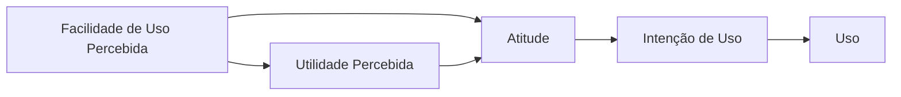
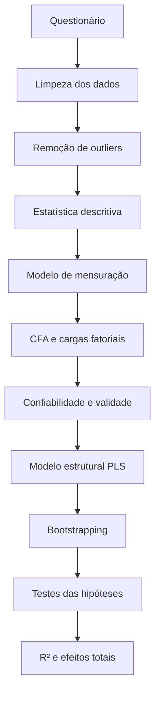
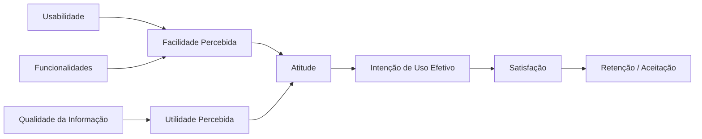
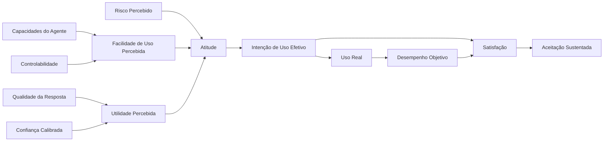
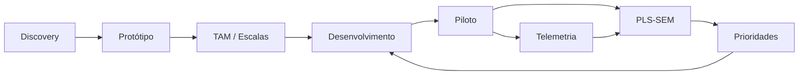

# TAM, Aceitação de Tecnologia e PLS-SEM

## Base conceitual e estatística da dissertação de Rodrigo Garcia Zaroni

Este documento resume a fundamentação teórica e o método estatístico da dissertação **Antecedentes e resultados do uso efetivo da plataforma tecnológica LMS na Educação a Distância: uma extensão ao modelo TAM**, apresentada por Rodrigo Garcia Zaroni ao IBMEC em 2014.

O objetivo é transformar a estrutura acadêmica da dissertação em uma referência prática para pesquisadores, arquitetos, engenheiros de software, product managers, profissionais de UX e equipes que desenvolvem aplicações, sistemas e agentes de Inteligência Artificial e desejam medir não apenas se uma solução funciona tecnicamente, mas se ela será percebida como útil, simples, adequada e efetivamente incorporada ao trabalho dos usuários finais.

A dissertação original teve como objeto a **aceitação e o uso efetivo de plataformas LMS por alunos de Educação a Distância em instituições brasileiras de ensino superior**, incluindo respondentes de instituições privadas e públicas. A amostra final utilizada na modelagem estatística foi de **212 alunos**, após tratamento de outliers. O modelo foi avaliado com **Modelagem de Equações Estruturais por Mínimos Quadrados Parciais, PLS-SEM**.

> Importante: as extensões propostas neste README para aplicações e agentes de IA constituem uma aplicação contemporânea dos princípios do TAM e da lógica causal da dissertação. Elas não foram testadas empiricamente na pesquisa de 2014 e, portanto, devem ser tratadas como hipóteses a serem validadas em novos estudos.

---

## 1. Por que aceitação de tecnologia continua sendo um problema de engenharia

Uma solução de software pode estar tecnicamente correta e ainda assim fracassar em produção.

Entre a capacidade técnica de um sistema e o seu uso real existe uma camada humana composta por percepção, esforço, confiança, expectativa, hábito, contexto organizacional, qualidade da informação, suporte e utilidade prática.

Em termos de produto, não basta perguntar:

- O sistema funciona?
- A API responde?
- O agente executa a tarefa?
- O modelo possui boa acurácia?
- O tempo de resposta está dentro do SLA?

Também é necessário perguntar:

- O usuário percebe valor no sistema?
- O sistema reduz esforço ou cria trabalho adicional?
- O usuário entende como utilizá-lo?
- As respostas são relevantes e confiáveis para a tarefa?
- O usuário pretende incorporá-lo à rotina?
- Ele explora apenas a função mínima ou usa efetivamente os recursos disponíveis?
- O uso melhora algum resultado objetivo?
- A experiência produz satisfação suficiente para sustentar a adoção?

O **Technology Acceptance Model, TAM**, criado por Fred Davis, fornece uma das bases clássicas para responder a essas perguntas.

---

# 2. Modelo TAM original

O TAM deriva da **Theory of Reasoned Action, TRA**, segundo a qual o comportamento é antecedido pela intenção comportamental, que por sua vez é influenciada pela atitude do indivíduo.

Davis adaptou essa lógica para o contexto de sistemas de informação.

Os quatro construtos centrais utilizados na dissertação são:

| Sigla | Construto | Definição resumida |
|---|---|---|
| UP / PU | Utilidade Percebida | Grau em que o usuário acredita que o sistema melhora seu desempenho |
| FUP / PEOU | Facilidade de Uso Percebida | Grau em que o usuário acredita que o sistema pode ser utilizado com pouco esforço |
| AT | Atitude em relação ao uso | Avaliação positiva ou negativa do uso da tecnologia |
| IU / BI | Intenção de Uso | Predisposição do indivíduo para utilizar a tecnologia |

A lógica essencial pode ser representada como:



A proposição central é simples, mas continua útil para desenvolvimento de software: **uma funcionalidade tecnicamente avançada não gera adoção automaticamente. A percepção de utilidade e a percepção de esforço influenciam a atitude e a intenção do usuário.**

---

# 3. Modelos que antecedem e ampliam o TAM

## 3.1 TRA, Theory of Reasoned Action

A TRA propõe que:

```text
Atitude + Norma Subjetiva -> Intenção -> Comportamento
```

A norma subjetiva representa a percepção de que pessoas relevantes para o indivíduo esperam determinado comportamento.

Em software corporativo isso pode ser observado, por exemplo, quando líderes, pares ou a cultura da empresa influenciam a adoção de uma ferramenta.

## 3.2 TPB, Theory of Planned Behavior

A **Theory of Planned Behavior, TPB**, amplia a TRA adicionando o **controle percebido sobre o comportamento**.

Mesmo que uma pessoa queira usar uma tecnologia e tenha atitude favorável, ela pode deixar de utilizá-la caso perceba que não possui recursos, conhecimento, acesso ou condições adequadas.

Uma leitura prática para sistemas atuais seria:

```text
Quero usar + acredito que vale a pena + tenho condições de usar -> maior probabilidade de adoção
```

---

# 4. TAM2

O TAM2 amplia o modelo original incorporando antecedentes sociais e cognitivos, principalmente relacionados à **Utilidade Percebida**.

Entre os construtos apresentados na dissertação estão:

| Grupo | Construto | Interpretação |
|---|---|---|
| Social | Norma Subjetiva | O que pessoas importantes esperam que o usuário faça |
| Social | Imagem | Possível efeito do uso da tecnologia sobre status ou imagem social |
| Cognitivo | Relevância para o Trabalho | Grau em que o sistema é relevante para a tarefa |
| Cognitivo | Qualidade da Saída | Qualidade percebida dos resultados gerados |
| Cognitivo | Demonstrabilidade dos Resultados | Facilidade de demonstrar concretamente os benefícios obtidos |

O TAM2 também considera moderações relacionadas à **experiência** e à **voluntariedade do uso**.

Isso é especialmente importante em sistemas corporativos. Um usuário obrigado a utilizar uma aplicação pode apresentar uso aparente sem necessariamente apresentar aceitação real.

---

# 5. UTAUT

A **Unified Theory of Acceptance and Use of Technology, UTAUT**, consolidou elementos de vários modelos anteriores.

Os principais fatores apresentados na dissertação são:

- expectativa de desempenho;
- expectativa de esforço;
- influência social;
- condições facilitadoras.

O modelo também incorpora moderações de:

- gênero;
- idade;
- experiência;
- voluntariedade.

Em projetos atuais, o UTAUT pode ser útil quando a adoção depende fortemente do contexto organizacional e de diferenças entre grupos de usuários.

---

# 6. TAM3

O TAM3 aprofunda os antecedentes de **Utilidade Percebida** e **Facilidade de Uso Percebida**.

Entre os antecedentes apresentados na dissertação estão:

### Antecedentes da Utilidade Percebida

- norma subjetiva;
- imagem;
- relevância para o trabalho;
- qualidade dos resultados;
- demonstrabilidade dos resultados.

### Antecedentes da Facilidade de Uso Percebida

- autoeficácia no uso de computadores;
- percepção de controle externo;
- ansiedade no uso de computadores;
- ludicidade;
- prazer percebido;
- usabilidade objetiva.

### Moderadores

- experiência;
- voluntariedade.

O TAM3 é particularmente interessante para produtos de IA porque separa uma questão importante: **a solução pode ser útil, mas ainda ser difícil, imprevisível ou desconfortável para o usuário.**

---

# 7. Extensão ao TAM proposta na dissertação

A dissertação não se limitou à intenção genérica de usar um LMS. O modelo procurou estudar **antecedentes e resultados do uso efetivo**.

Um ponto importante foi substituir o construto tradicional **Intenção de Uso, IU**, por **Intenção de Uso Efetivo, IUE**.

A diferença é relevante.

```text
Intenção de uso:
"Pretendo utilizar o sistema."

Intenção de uso efetivo:
"Pretendo explorar suas funcionalidades, descobrir novas formas de utilizá-lo,
integrá-lo à minha rotina e extrair o máximo de benefício da tecnologia."
```

Essa distinção é diretamente aplicável a agentes de IA.

Um usuário pode abrir um chatbot algumas vezes por semana e, ainda assim, utilizar uma parcela mínima de seu potencial. Uso efetivo significaria integrar o sistema ao fluxo real de trabalho, utilizar ferramentas, contexto, arquivos, recuperação de informação, automações, integrações e outros recursos relevantes para a tarefa.

---

# 8. Construtos utilizados na extensão da dissertação

O modelo proposto trabalhou com 16 construtos principais. Durante a análise, a Absorção Cognitiva foi separada nas dimensões **Foco** e **Play, diversão**.

| Sigla | Construto | Grupo conceitual |
|---|---|---|
| UP | Utilidade Percebida | TAM |
| FUP | Facilidade de Uso Percebida | TAM |
| AT | Atitude em relação ao LMS | TAM |
| IUE | Intenção de Uso Efetivo | Extensão do TAM |
| SAT | Satisfação com o curso | Resultado |
| ATEAD | Atitude geral em relação à EaD | Resultado |
| DES | Desempenho | Resultado |
| FSI | Funcionalidades do Sistema | Tecnológico |
| ISI | Interatividade do Sistema | Tecnológico |
| QI | Qualidade das Informações | Tecnológico |
| INS | Características do Instrutor | Institucional |
| FLEX | Flexibilidade | Institucional/contextual |
| IES | Apoio da Instituição de Ensino | Institucional |
| AC | Absorção Cognitiva | Individual |
| ORG | Autogerenciamento | Individual |
| COMP | Comprometimento | Individual |

---

# 9. Hipóteses do modelo original da dissertação

Foram propostas 24 relações para explicar os caminhos entre os construtos.

```text
H1   UP -> AT
H2   FUP -> AT
H3   AT -> IUE
H4   FUP -> UP
H5   IUE -> DES
H6   IUE -> SAT
H7   DES -> SAT
H8   SAT -> ATEAD
H9a  FSI -> UP
H9b  FSI -> FUP
H10a ISI -> UP
H10b ISI -> FUP
H11  QI -> UP
H12a INS -> UP
H12b INS -> FUP
H13  FLEX -> FUP
H14  IES -> FUP
H15a AC -> UP
H15b AC -> FUP
H16a ORG -> UP
H16b ORG -> FUP
H16c ORG -> DES
H17a COMP -> IUE, moderado por UP
H17b COMP -> DES
```

A existência de hipóteses não suportadas é metodologicamente importante. Um modelo causal deve ser usado para **testar relações**, não para confirmar pressupostos previamente desejados pelo time de produto.

---

# 10. Público e desenho da pesquisa original

A pesquisa foi aplicada a alunos brasileiros de Educação a Distância e cursos com componentes EaD.

## Coleta

- questionários enviados: **2.820**;
- questionários integralmente respondidos: **278**;
- taxa de resposta integral: **9,86%**;
- outliers removidos: **66**;
- amostra final: **212 respondentes**.

## Instituições

O Apêndice C registra respondentes provenientes de instituições privadas e de instituição pública:

| Grupo de IES | n | % |
|---|---:|---:|
| IES privada RJ 1 | 153 | 72,2% |
| IES privada RJ 2 | 35 | 16,5% |
| IES privada brasileira 2 | 11 | 5,2% |
| IES pública | 11 | 5,2% |
| Outra | 2 | 0,9% |
| **Total** | **212** | **100%** |

O texto metodológico informa que a amostra era predominantemente composta por alunos de duas IES privadas localizadas no Rio de Janeiro.

## Modalidade

- EaD integral: **77,4%**;
- blended: **22,6%**.

## Plataformas

- Moodle: **78%**;
- Blackboard: **22%**.

A pesquisa, portanto, mediu empiricamente a aceitação e os resultados associados ao uso de LMS no contexto real de alunos brasileiros de Educação a Distância.

---

# 11. Instrumento de pesquisa

A dissertação utilizou itens provenientes de escalas previamente testadas na literatura, adaptados ao contexto do estudo.

As questões psicométricas foram avaliadas em **escala Likert de 7 pontos**:

```text
1 = discordo totalmente
...
7 = concordo totalmente
```

Entre as dimensões mensuradas estavam:

- atitude em relação à EaD;
- satisfação;
- intenção de uso efetivo;
- atitude em relação ao LMS;
- utilidade percebida;
- facilidade de uso percebida;
- comprometimento;
- autogerenciamento;
- funcionalidades;
- interatividade;
- qualidade da informação;
- absorção cognitiva;
- características do instrutor;
- flexibilidade;
- apoio institucional;
- desempenho.

---

# 12. Pipeline estatístico utilizado

A dissertação utilizou uma abordagem quantitativa com **Modelagem de Equações Estruturais baseada em Partial Least Squares, PLS-SEM**.

Fluxo resumido:



### Software original

- **SPSS** para limpeza e estatística descritiva;
- **SmartPLS 2.0.M3** para estimação PLS e testes do modelo estrutural.

---

# 13. Tratamento de outliers

Dos 278 questionários completos, 66 observações foram removidas como outliers com base na **Distância de Mahalanobis**, utilizando alfa de 0,001.

```text
n inicial completo = 278
outliers removidos = 66
n final = 212
```

Para uma replicação atual, a remoção de outliers deve ser justificada teoricamente e acompanhada de análise de sensibilidade. Remover observações somente porque pioram o ajuste do modelo introduz viés.

---

# 14. PLS-SEM

A técnica PLS foi selecionada por permitir trabalhar com:

- modelos com múltiplas relações causais simultâneas;
- construtos reflexivos e formativos;
- efeitos de moderação;
- amostras relativamente pequenas;
- situações com desvios de normalidade multivariada;
- possíveis problemas de multicolinearidade.

O modelo possuía diversos construtos latentes e relações diretas e indiretas, o que tornou a abordagem PLS adequada ao objetivo preditivo e causal proposto pela dissertação.

---

# 15. Modelo de mensuração

Antes de interpretar os caminhos estruturais, a dissertação verificou se os construtos estavam sendo adequadamente medidos.

## 15.1 Cargas fatoriais

Foi realizada análise fatorial confirmatória e adotado como referência:

```text
loading >= 0,70
```

Itens abaixo de 0,70 ou com carregamento inadequado em múltiplos fatores foram removidos para melhorar o modelo de mensuração.

A lógica é que uma carga de aproximadamente 0,70 implica que cerca de metade da variância do indicador pode ser associada ao construto latente.

## 15.2 Absorção cognitiva

O construto Absorção Cognitiva foi separado em duas dimensões durante a análise:

- **ACFoco**;
- **ACPlay**, diversão/ludicidade.

## 15.3 Desempenho

O desempenho foi tratado como construto formativo durante a análise final em razão das limitações para obtenção do coeficiente de rendimento real de todos os alunos.

Essa limitação deve ser considerada ao interpretar os resultados associados a DES.

---

# 16. Confiabilidade e validade

A dissertação utilizou como valores mínimos de referência:

```text
AVE > 0,50
Composite Reliability > 0,70
Cronbach's Alpha > 0,70
```

## 16.1 Alfa de Cronbach

Mede consistência interna dos indicadores de um construto.

## 16.2 Confiabilidade composta

A **Composite Reliability, CR**, foi tratada como indicador particularmente relevante da confiabilidade interna dos construtos em PLS.

## 16.3 Average Variance Extracted, AVE

A AVE mede quanto da variância dos indicadores é explicada pelo respectivo construto.

```text
AVE > 0,50
```

indica que o construto explica, em média, mais da metade da variância dos seus indicadores.

## 16.4 Validade discriminante

A dissertação utilizou o critério hoje conhecido como **Fornell-Larcker**:

```text
sqrt(AVE do construto) > correlação com os demais construtos
```

O objetivo é verificar se cada variável latente mede um fenômeno suficientemente distinto das demais.

Para replicações atuais, recomenda-se complementar essa análise com **HTMT**, além de avaliar cross-loadings quando aplicável.

---

# 17. Bootstrapping

A significância dos efeitos estimados pelo modelo PLS foi obtida por bootstrapping.

Configuração original:

```text
cases = 212
bootstrap samples = 1000
```

Os caminhos estruturais foram avaliados pelos coeficientes beta, estatística t e significância estatística.

Convenção apresentada na dissertação:

```text
*   p < 0,05
**  p < 0,01
*** p < 0,001
```

---

# 18. Poder explicativo do modelo

O modelo apresentou os seguintes valores de variância explicada, R²:

| Variável endógena | R² aproximado |
|---|---:|
| Atitude em relação ao LMS, AT | 75,3% |
| Atitude geral em relação à EaD, ATEAD | 75,0% |
| Utilidade Percebida, UP | 68,0% |
| Facilidade de Uso Percebida, FUP | 67,9% |
| Intenção de Uso Efetivo, IUE | 56,7% |
| Satisfação, SAT | 37,0% |
| Desempenho, DES | 19,2% |

A dissertação ressalta que o R² de desempenho pode ter sido afetado pela impossibilidade de obter os resultados acadêmicos reais de todos os alunos.

---

# 19. Principais relações suportadas

Entre as relações estatisticamente significativas encontradas estavam:

| Relação | β | p |
|---|---:|---:|
| UP -> AT | 0,798 | < 0,001 |
| FUP -> AT | 0,100 | 0,039 |
| AT -> IUE | 0,362 | 0,001 |
| IUE -> SAT | 0,533 | < 0,001 |
| DES -> SAT | 0,211 | 0,002 |
| SAT -> ATEAD | 0,866 | < 0,001 |
| FSI -> FUP | 0,613 | < 0,001 |
| QI -> UP | 0,231 | 0,020 |
| INS -> FUP | 0,178 | 0,046 |
| ACFoco -> UP | 0,193 | 0,003 |
| ACPlay -> UP | 0,258 | 0,001 |
| ORG -> DES | 0,408 | 0,005 |

A relação mais forte entre as hipóteses centrais suportadas foi:

```text
Satisfação -> Atitude geral em relação à EaD
β = 0,866
```

Também se destacou:

```text
Utilidade Percebida -> Atitude em relação ao sistema
β = 0,798
```

Esses resultados reforçam que **valor percebido e satisfação possuem papel central no processo de aceitação**.

---

# 20. Relações não suportadas também importam

Nem todas as hipóteses foram confirmadas.

Entre as relações não suportadas na amostra estavam:

```text
FUP -> UP
IUE -> DES
FSI -> UP
ISI -> UP
ISI -> FUP
INS -> UP
FLEX -> FUP
IES -> FUP
ACFoco -> FUP
ACPlay -> FUP
ORG -> UP
ORG -> FUP
COMP -> IUE
COMP -> DES
```

A moderação proposta de UP na relação COMP -> IUE também não foi suportada conforme a direção teórica esperada.

Isso é importante para equipes de desenvolvimento: **um fator intuitivamente relevante não deve ser tratado como causal antes de ser testado.**

---

# 21. Efeitos totais

Além dos caminhos diretos, a dissertação analisou efeitos totais e encontrou efeitos indiretos relevantes.

Por exemplo, a Utilidade Percebida apresentou efeitos totais significativos sobre:

```text
UP -> IUE    = 0,445
UP -> SAT    = 0,235
UP -> ATEAD  = 0,203
```

Isso mostra que uma variável pode ser importante mesmo quando não possui um caminho direto até o resultado final.

Para produtos digitais, essa visão evita análises simplistas do tipo:

```text
"Esta funcionalidade não altera diretamente a retenção, então não importa."
```

Ela pode alterar utilidade, atitude, intenção de uso e satisfação, produzindo posteriormente um efeito indireto sobre retenção ou adoção.

---

# 22. Aplicação prática em desenvolvimento de software

O TAM pode ser utilizado como instrumento complementar a UX Research, Product Analytics, testes de usabilidade e telemetria.

Uma equipe pode tratar a aceitação de uma aplicação como um sistema causal mensurável.

Exemplo:



O valor do modelo não está em substituir analytics ou entrevistas, mas em fornecer uma teoria explícita sobre **por que** determinadas métricas se relacionam.

---

# 23. Aplicação prática em agentes de IA

Para agentes de IA, o problema de aceitação é ainda mais relevante porque a interação deixa de ser completamente determinística.

O usuário passa a avaliar não apenas a interface, mas também:

- qualidade das respostas;
- consistência;
- previsibilidade;
- nível de autonomia;
- possibilidade de correção;
- transparência;
- confiança;
- risco percebido;
- esforço para escrever prompts;
- integração com o trabalho real;
- capacidade do agente de completar tarefas de ponta a ponta.

Uma adaptação operacional do modelo pode ser feita da seguinte maneira.

| TAM / Dissertação | Aplicação em IA |
|---|---|
| UP | O agente realmente melhora velocidade, qualidade ou produtividade? |
| FUP | É fácil conversar, instruir, corrigir e recuperar erros? |
| AT | O usuário possui atitude positiva em relação ao agente? |
| IUE | O usuário pretende integrar efetivamente o agente ao trabalho? |
| FSI | O agente possui as capacidades necessárias, ferramentas, RAG, memória, integrações? |
| ISI | A interação é natural, controlável e adequada à tarefa? |
| QI | A resposta é correta, relevante, completa, atual e compreensível? |
| INS | Treinamento, onboarding, champion, suporte e capacitação para uso |
| IES | Infraestrutura, políticas, acesso, segurança e suporte organizacional |
| AC | A interação mantém foco e engajamento sem impor carga cognitiva excessiva? |
| ORG | O usuário consegue incorporar o agente ao próprio processo de trabalho? |
| COMP | Existe engajamento real com a solução? |
| DES | O agente melhora métricas objetivas do trabalho? |
| SAT | O usuário está satisfeito com a experiência e resultados? |

---

# 24. Intenção de Uso Efetivo para agentes de IA

A contribuição conceitual da dissertação relacionada à IUE pode ser especialmente útil para IA.

Não medir apenas:

```text
"Pretendo usar o agente novamente."
```

Medir também:

```text
"Pretendo explorar diferentes capacidades do agente."
"Pretendo integrar o agente ao meu fluxo real de trabalho."
"Pretendo utilizar o agente em tarefas relevantes, e não apenas em testes."
"Pretendo aprender novas formas de utilizar o agente."
"Pretendo extrair o máximo de benefício das funcionalidades disponíveis."
```

Essa abordagem separa **adoção superficial** de **adoção efetiva**.

---

# 25. Extensão contemporânea sugerida para IA

Os construtos abaixo **não fizeram parte do modelo empírico de 2014**. Eles são propostos aqui como hipóteses para pesquisas atuais sobre IA.

## 25.1 Confiança calibrada

Não basta maximizar confiança.

Um agente confiável deve levar o usuário a confiar quando há evidência suficiente e a revisar resultados quando há incerteza.

Possível relação:

```text
Confiabilidade Percebida -> Utilidade Percebida
Confiabilidade Percebida -> Atitude
```

## 25.2 Transparência e explicabilidade

```text
Transparência -> Confiança Calibrada
Transparência -> Facilidade de Validação
```

## 25.3 Risco percebido

```text
Risco Percebido -> Atitude (-)
Risco Percebido -> Intenção de Uso Efetivo (-)
```

Pode incluir:

- privacidade;
- segurança;
- erro factual;
- vazamento de informação;
- decisões incorretas;
- risco jurídico;
- impacto reputacional.

## 25.4 Controlabilidade e supervisão humana

```text
Controle Percebido -> Facilidade de Uso
Controle Percebido -> Confiança
Controle Percebido -> Intenção de Uso Efetivo
```

## 25.5 Qualidade da resposta de IA

Uma atualização de QI pode avaliar:

- correção;
- relevância;
- completude;
- atualidade;
- rastreabilidade;
- qualidade das fontes;
- consistência;
- aderência ao contexto;
- capacidade de reconhecer incerteza.

---

# 26. Modelo conceitual sugerido para aceitação de agentes de IA



Esse modelo deve ser entendido como uma proposta de pesquisa, não como resultado comprovado pela dissertação original.

---

# 27. Métricas objetivas recomendadas para IA

Uma evolução natural da pesquisa é combinar psicometria com telemetria real.

## Uso real

```text
sessões por usuário
usuários ativos
frequência semanal
retenção
número de tarefas delegadas
percentual de tarefas concluídas
uso de ferramentas
uso de integrações
uso de memória ou contexto
```

## Desempenho

```text
tempo por tarefa
taxa de conclusão
taxa de erro
retrabalho
qualidade avaliada por especialista
SLA
custo por tarefa
produtividade
```

## Qualidade do agente

```text
accuracy
precision / recall quando aplicável
faithfulness em RAG
context relevance
answer relevance
hallucination rate
tool success rate
handoff rate
human override rate
```

A combinação ideal é:

```text
percepção do usuário + comportamento observado + resultado objetivo
```

---

# 28. Protocolo recomendado para validar um novo sistema ou agente de IA

## Fase 1. Definição do problema

Definir:

- tarefa principal;
- público;
- processo atual;
- resultado esperado;
- riscos;
- uso voluntário ou obrigatório.

## Fase 2. Definição dos construtos

Selecionar apenas os construtos teoricamente necessários.

Modelo mínimo:

```text
UP
FUP
AT
IUE
SAT
```

Modelo ampliado para IA:

```text
UP
FUP
AT
IUE
SAT
QI
FSI
Confiança
Risco
Controlabilidade
Uso Real
Desempenho
```

## Fase 3. Instrumento

Criar múltiplos itens por construto e utilizar, sempre que possível, escalas já validadas.

## Fase 4. Piloto

Aplicar a uma pequena amostra para detectar:

- questões ambíguas;
- itens redundantes;
- itens reversos problemáticos;
- efeito teto;
- efeito piso;
- tempo excessivo de resposta.

## Fase 5. Coleta

Registrar também telemetria real quando possível.

## Fase 6. Modelo de mensuração

Avaliar:

```text
loadings
Cronbach's alpha
Composite Reliability
AVE
validade discriminante
HTMT
cross-loadings
```

## Fase 7. Modelo estrutural

Avaliar:

```text
path coefficients
bootstrapping
p-values
confidence intervals
R²
f²
Q²
collinearity / VIF
indirect effects
moderation
mediation
```

## Fase 8. Decisão de produto

Converter os resultados em ações concretas.

Exemplo:

```text
QI -> UP forte
```

Prioridade:

```text
melhorar conteúdo, grounding, RAG, fontes e validação da resposta
```

Outro exemplo:

```text
FUP -> AT forte
```

Prioridade:

```text
reduzir complexidade da interface, quantidade de passos e esforço de prompting
```

---

# 29. Exemplo de hipóteses para um agente corporativo de IA

```text
H1  Utilidade Percebida -> Atitude
H2  Facilidade de Uso Percebida -> Atitude
H3  Atitude -> Intenção de Uso Efetivo
H4  Qualidade da Resposta -> Utilidade Percebida
H5  Capacidades do Agente -> Utilidade Percebida
H6  Controlabilidade -> Facilidade de Uso Percebida
H7  Confiança Calibrada -> Utilidade Percebida
H8  Risco Percebido -> Atitude, relação negativa
H9  Intenção de Uso Efetivo -> Uso Real
H10 Uso Real -> Desempenho
H11 Desempenho -> Satisfação
H12 Satisfação -> Continuidade de Uso
```

---

# 30. Questionário mínimo de exemplo para IA

Escala Likert de 1 a 7.

## Utilidade Percebida

```text
UP1 O agente me permite concluir minhas tarefas mais rapidamente.
UP2 O agente melhora meu desempenho na atividade.
UP3 O agente aumenta minha produtividade.
UP4 O agente é útil para a execução do meu trabalho.
```

## Facilidade de Uso Percebida

```text
FUP1 É fácil aprender a utilizar o agente.
FUP2 É fácil conseguir que o agente execute o que preciso.
FUP3 A interação com o agente é clara e compreensível.
FUP4 É fácil tornar-me hábil no uso do agente.
```

## Intenção de Uso Efetivo

Inspirada no conceito de IUE utilizado na dissertação:

```text
IUE1 Pretendo explorar ao máximo as funcionalidades do agente.
IUE2 Pretendo descobrir novas formas de usar o agente no meu trabalho.
IUE3 Pretendo integrar o agente à minha rotina de trabalho.
IUE4 Pretendo tirar o máximo proveito do agente nas atividades em que ele for adequado.
```

## Qualidade da Informação

```text
QI1 As respostas são relevantes para a tarefa.
QI2 As respostas são fáceis de compreender.
QI3 As respostas apresentam nível adequado de completude.
QI4 As informações fornecidas são suficientemente atualizadas para minha necessidade.
QI5 As respostas são suficientemente corretas para o contexto em que utilizo o agente.
```

---

# 31. Esqueleto de análise em Python

A dissertação original utilizou SPSS e SmartPLS. Em uma implementação moderna, Python pode ser utilizado para limpeza, estatística descritiva, psicometria, análise exploratória, preparação dos dados e validações auxiliares.

Exemplo básico de preparação:

```python
import pandas as pd
import numpy as np

from scipy.stats import chi2
from sklearn.covariance import MinCovDet


def mahalanobis_outliers(df: pd.DataFrame, alpha: float = 0.001):
    """Identifica potenciais outliers multivariados usando Mahalanobis robusta."""

    x = df.select_dtypes(include=np.number).dropna()

    estimator = MinCovDet(random_state=42).fit(x)
    distances = estimator.mahalanobis(x)

    threshold = chi2.ppf(1 - alpha, df=x.shape[1])

    result = pd.DataFrame(
        {
            "mahalanobis": distances,
            "threshold": threshold,
            "outlier": distances > threshold,
        },
        index=x.index,
    )

    return result
```

Cronbach Alpha:

```python
import pandas as pd


def cronbach_alpha(items: pd.DataFrame) -> float:
    items = items.dropna()
    k = items.shape[1]

    item_variances = items.var(axis=0, ddof=1).sum()
    total_variance = items.sum(axis=1).var(ddof=1)

    return (k / (k - 1)) * (1 - item_variances / total_variance)
```

Exemplo:

```python
alpha_up = cronbach_alpha(
    df[["UP1", "UP2", "UP3", "UP4", "UP5", "UP6"]]
)

print(alpha_up)
```

> Atenção: SEM por covariância e PLS-SEM não são estatisticamente equivalentes. Uma replicação rigorosa deve utilizar uma implementação específica de PLS-SEM ou SmartPLS e não substituir automaticamente PLS por uma biblioteca de CB-SEM apenas porque ambas trabalham com modelos estruturais.

---

# 32. O que uma equipe de software deve aprender com o modelo

## 32.1 Utilidade tende a importar mais do que quantidade de funcionalidades

Na dissertação, a relação entre Utilidade Percebida e Atitude foi forte.

Para produto:

```text
mais funcionalidades != mais aceitação
```

Uma funcionalidade precisa contribuir para uma tarefa relevante.

## 32.2 Facilidade continua importante

O usuário precisa compreender como obter valor da solução sem esforço desnecessário.

Em IA, isso inclui:

- esforço de prompting;
- necessidade de conhecer sintaxe;
- número de correções necessárias;
- facilidade de recuperar-se de erros;
- capacidade de revisar ações do agente.

## 32.3 Qualidade da informação é parte do produto

Em um sistema de IA, a saída do modelo não é um detalhe separado da experiência. Ela é parte central da utilidade percebida.

## 32.4 Uso não significa uso efetivo

Métricas de login podem superestimar adoção.

É melhor medir:

```text
uso de funcionalidades relevantes
integração ao fluxo real
qualidade dos resultados
frequência de tarefas concluídas
continuidade
```

## 32.5 Satisfação pode funcionar como elo entre resultado e aceitação geral

O modelo mostrou forte relação entre satisfação e atitude geral em relação à modalidade EaD.

Em produtos, isso sugere acompanhar a satisfação como variável causal potencial, e não apenas como uma métrica de pesquisa pós-uso.

---

# 33. Cuidados metodológicos

A dissertação apresenta limitações que devem ser preservadas ao reutilizar seus resultados.

- amostra final relativamente pequena, n = 212;
- coleta predominantemente concentrada em IES privadas do Rio de Janeiro;
- desenho quantitativo e transversal;
- ausência de complemento qualitativo;
- limitações para obtenção do desempenho acadêmico real de todos os alunos;
- alguns itens foram removidos após CFA;
- nem todas as hipóteses propostas foram suportadas.

Portanto, os coeficientes encontrados **não devem ser tratados como constantes universais** para outros contextos.

O que pode ser reutilizado com maior segurança é:

- a lógica teórica;
- o desenho dos construtos;
- o processo de criação de hipóteses;
- o pipeline de mensuração;
- a abordagem PLS-SEM;
- a ideia de medir uso efetivo e não apenas intenção genérica de uso.

---

# 34. Melhorias recomendadas para uma replicação atual

Uma pesquisa contemporânea pode ampliar o protocolo original com:

```text
HTMT para validade discriminante
VIF para colinearidade
f² para tamanho de efeito
Q² para relevância preditiva
confidence intervals por bootstrap
mediação
moderação
PLSpredict
análise multigrupo
measurement invariance
análise longitudinal
telemetria comportamental
métricas objetivas de desempenho
entrevistas qualitativas
```

Para agentes de IA, acrescentaria ainda:

```text
trust calibration
perceived risk
human oversight
controllability
transparency
AI literacy
hallucination perception
privacy concerns
security concerns
```

Esses construtos adicionais precisam ser teoricamente definidos e empiricamente validados antes de serem incorporados definitivamente ao modelo.

---

# 35. Interpretação para Product Discovery

O modelo pode ser aplicado antes mesmo do desenvolvimento final.

### Exemplo

Um protótipo de agente de IA apresenta baixa intenção de uso efetivo.

O time mede:

```text
UP = alta
FUP = baixa
QI = alta
AT = moderada
```

Interpretação provável:

```text
O problema não está necessariamente na capacidade da IA.
O usuário percebe valor, mas encontra esforço elevado para obtê-lo.
```

A decisão pode ser priorizar:

- UX;
- onboarding;
- templates;
- sugestões de ações;
- preenchimento automático de contexto;
- redução de etapas;
- melhor recuperação de erros.

O TAM, portanto, pode ajudar a transformar percepções subjetivas em hipóteses mensuráveis de engenharia de produto.

---

# 36. Interpretação para desenvolvimento de agentes

Um agente pode ser tecnicamente capaz e ter baixa aceitação por diferentes razões.

```text
Baixa UP  -> não resolve um problema relevante.
Baixa FUP -> exige esforço excessivo.
Baixa QI  -> respostas não sustentam a tarefa.
Baixa AT  -> experiência geral negativa.
Baixa IUE -> usuário não pretende incorporá-lo ao trabalho.
Baixo DES -> uso não produz resultado mensurável.
Baixa SAT -> experiência não sustenta continuidade.
```

Essa decomposição ajuda a evitar a conclusão genérica:

```text
"Os usuários não gostaram da IA."
```

O problema pode estar em uma parte específica do sistema causal.

---

# 37. Recomendação de uso no ciclo de desenvolvimento



O objetivo não é transformar todo projeto em uma dissertação acadêmica, mas utilizar o raciocínio científico para reduzir decisões baseadas somente em opinião.

---
## Base Estatística do Projeto Original

[Zaroni - Dissertação - Validação Estatística no Google Colab](https://github.com/ztechbr/dissertacao_base_estatistica/blob/main/Zaroni_Dissertacao_Validacao_Estatistica_COLAB.ipynb)

> **Observação sobre os dados utilizados**
>
> Para execução, teste e validação do código estatístico, utilize a **[Planilha com Dados Sintéticos](https://github.com/ztechbr/dissertacao_base_estatistica/blob/main/Dissertacao_Zaroni_Sintetico_2000.xlsx)** disponibilizada neste projeto.
>
> Os dados presentes nessa planilha **não correspondem aos dados reais coletados no questionário aplicado aos alunos em 2014**. A base original da pesquisa não é disponibilizada por questões de confidencialidade, privacidade dos participantes e proteção dos dados.
>
> Conforme descrito na dissertação, a coleta foi realizada de forma voluntária e confidencial. Os dados utilizados na pesquisa acadêmica foram tratados de forma anonimizada, e o processamento estatístico da base original foi realizado no contexto da dissertação, em conjunto com o orientador responsável pela pesquisa.
>
> A planilha disponibilizada neste repositório contém **dados sintéticos**, estruturados para permitir a reprodução do fluxo de análise estatística, a execução dos códigos e a compreensão das técnicas empregadas na dissertação.
>
> Portanto, essa base deve ser utilizada exclusivamente para **fins acadêmicos, educacionais, experimentais e de validação do código**, não devendo ser interpretada como reprodução dos dados individuais dos participantes nem como a base original utilizada na pesquisa de 2014.


# 38. Referências centrais

## Dissertação base

ZARONI, Rodrigo Garcia. **Antecedentes e resultados do uso efetivo da plataforma tecnológica LMS na Educação a Distância: uma extensão ao modelo TAM**. Dissertação de Mestrado Profissionalizante em Administração. IBMEC, Rio de Janeiro, 2014.

## Bases teóricas citadas na dissertação

DAVIS, F. D. **A Technology Acceptance Model for Empirically Testing New End-User Information Systems: Theory and Results**. MIT, 1985.

DAVIS, F. D. **Perceived usefulness, perceived ease of use, and user acceptance of information technology**. MIS Quarterly, 1989.

VENKATESH, V.; DAVIS, F. D. **A theoretical extension of the Technology Acceptance Model: Four longitudinal field studies**. Management Science, 2000.

VENKATESH, V.; MORRIS, M. G.; DAVIS, G. B.; DAVIS, F. D. **User acceptance of information technology: Toward a unified view**. MIS Quarterly, 2003.

VENKATESH, V.; BALA, H. **Technology Acceptance Model 3 and a research agenda on interventions**. Decision Sciences, 2008.

CHIN, W. W. **How to write up and report PLS analyses**. Handbook of Partial Least Squares, 2010.

HAIR, J. F.; RINGLE, C. M.; SARSTEDT, M. **Partial Least Squares Structural Equation Modeling: Rigorous Applications, Better Results and Higher Acceptance**. Long Range Planning, 2013.

---

# 39. Síntese

O ponto central do modelo pode ser resumido como:

```text
Tecnologia tecnicamente capaz
        ↓
Qualidade + funcionalidades + contexto + experiência do usuário
        ↓
Utilidade percebida + facilidade percebida
        ↓
Atitude
        ↓
Intenção de uso efetivo
        ↓
Uso e resultados
        ↓
Satisfação
        ↓
Aceitação sustentada
```

Para aplicações e agentes de IA, a principal consequência prática é clara: **qualidade técnica é condição necessária, mas não suficiente.**

A aceitação deve ser tratada como uma variável de engenharia e produto que pode ser definida, instrumentada, mensurada, testada e acompanhada ao longo do ciclo de vida da solução.

